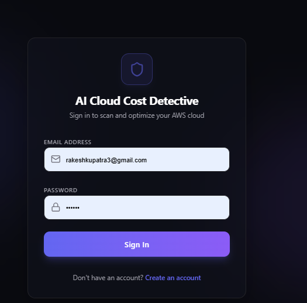
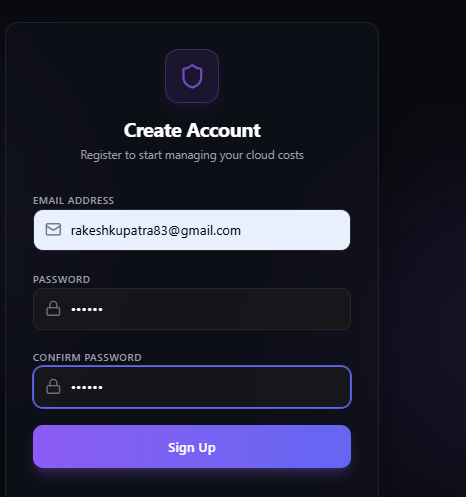
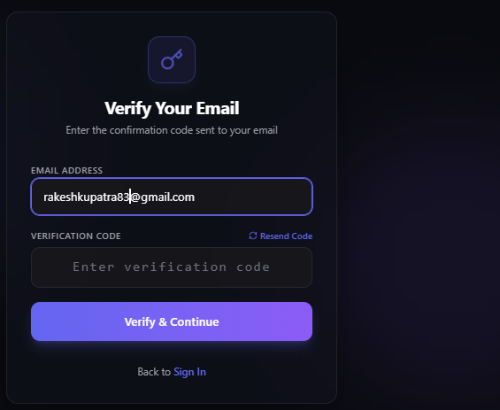
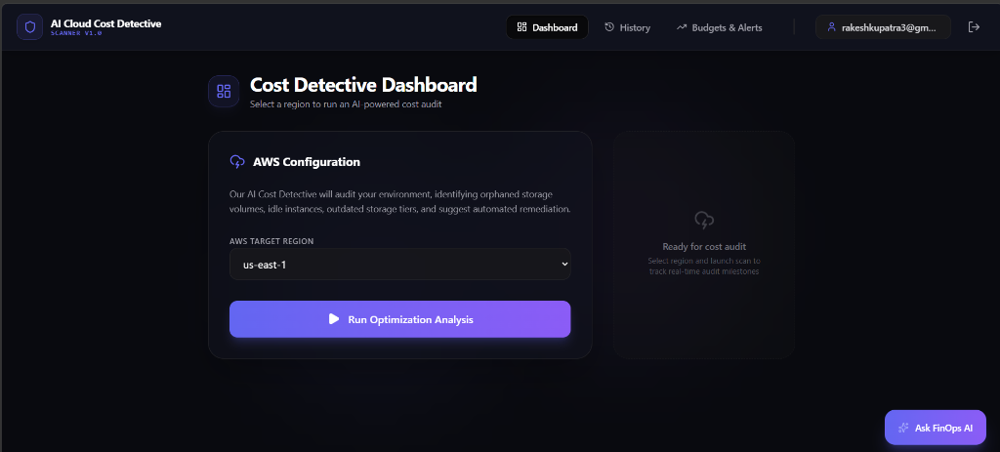
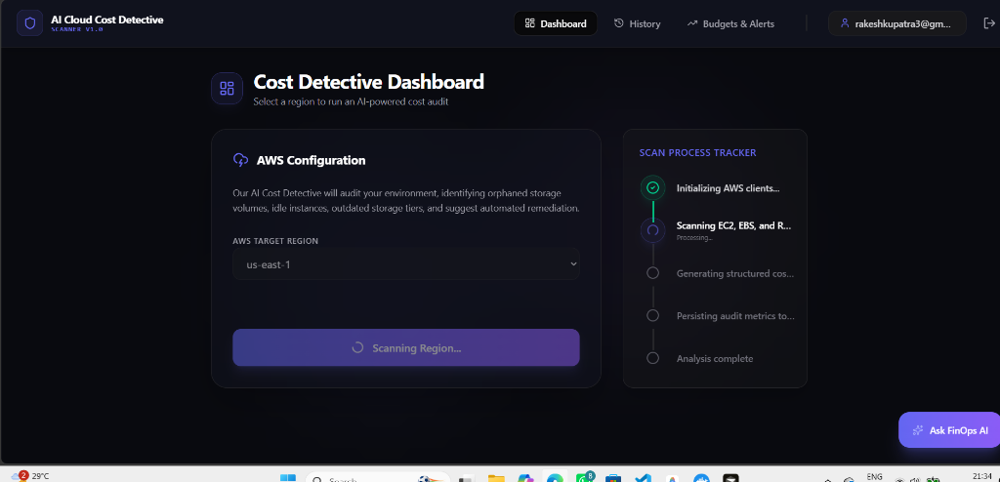
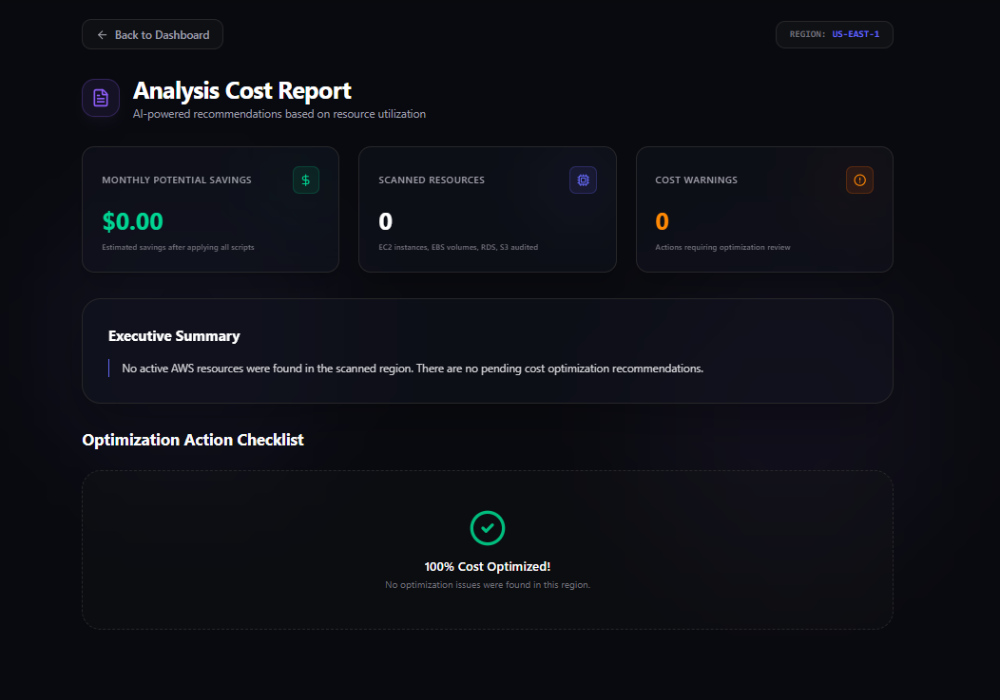
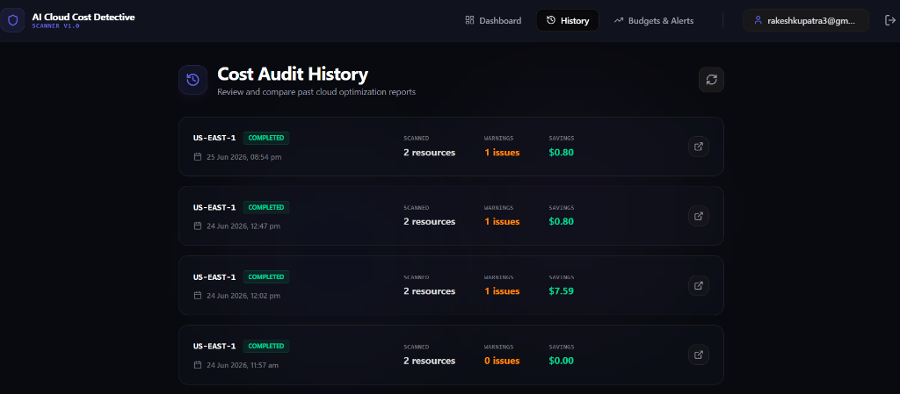
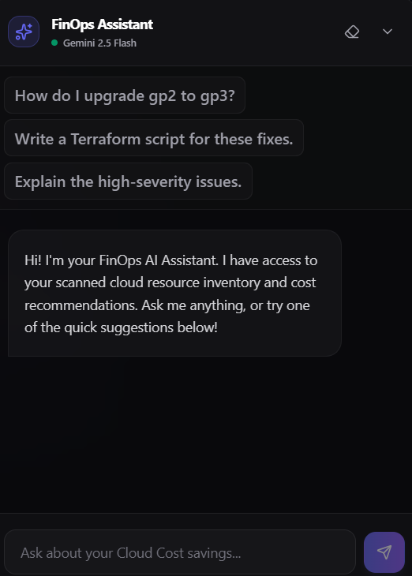
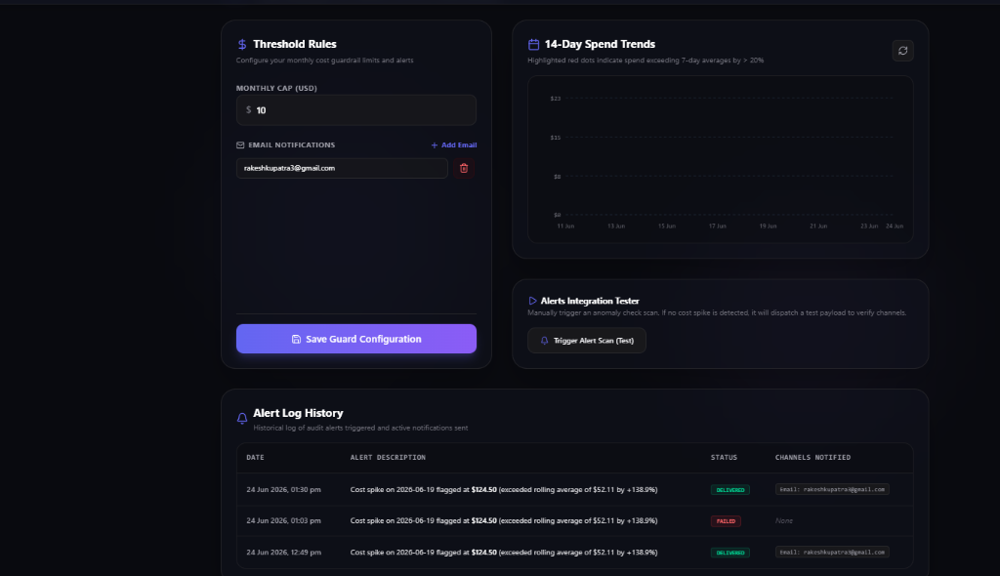
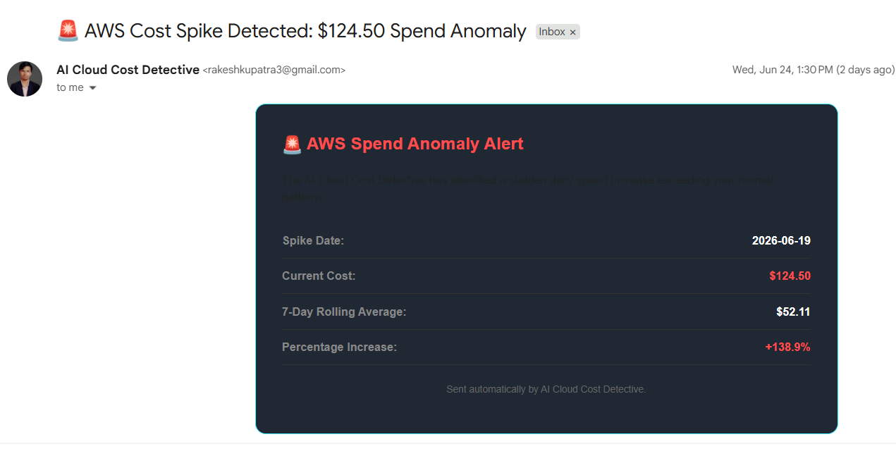

# 🔍 AI Cloud Cost Detective — Enterprise FinOps & Cost Optimization Platform

Welcome to the **AI Cloud Cost Detective** repository! This platform helps engineering, finance, and DevOps teams track, analyze, and optimize cloud expenses. By combining automated AWS infrastructure scans with **Gemini AI**, it identifies orphaned assets, recommends cost-saving measures (such as upgrading storage types from `gp2` to `gp3`), alerts teams to budget spikes, and enables automatic remediation.

The repository is built as a containerized multi-tier web application (FastAPI backend + Vite/React frontend) backed by a local SQLite database for configurations and an InsForge managed cloud database for audit tracking. It is fully guarded by a **DevSecOps shift-left security pipeline** to prevent any credential leaks.

---

## 🗺️ System Architecture Overview

```
                          ┌──────────────────────────┐
                          │    Vite / React Web UI   │
                          │   (TypeScript/Tailwind)  │
                          └─────────────┬────────────┘
                                        │
                         HTTP & WebSockets (Port 5173/8080)
                                        │
                                        ▼
                          ┌──────────────────────────┐
                          │      FastAPI Backend     │◄─────────┐
                          │         (Python)         │          │
                          └──────────┬───┬───────────┘          │
                                     │   │                      │
                  boto3 AWS API Scans │   │ Gemini API           │
                                     │   │ (AI Analysis)        │
                                     ▼   ▼                      ▼
                            ┌──────────────┐          ┌───────────────────┐
                            │  AWS Cloud   │          │  InsForge Cloud   │
                            │ Infrastructure│         │  Audit Database   │
                            └──────────────┘          └───────────────────┘
                                                                ▲
                                                                │
                                    Local Sync (Anomaly Logs)   │
                                                                │
                                                      ┌─────────┴─────────┐
                                                      │ SQLite Local DB   │
                                                      │   (db.sqlite3)    │
                                                      └───────────────────┘
```

---

## 🚀 Key Platform Features

Here is what the application provides:

### 1. Secure Authentication & Verification Flow
User sessions are safely handled via secure InsForge authentication steps:
- **Registration:** Complete a signup with email and password configs.
- **Email Verification:** Simple verification processes prevent fake accounts.
- **Login Portal:** Secure authentication to retrieve session access tokens.

<p align="center">
  
  
  
</p>
<p align="center"><em>Figures 1, 2, & 3: Login, Registration, and Email Verification interfaces</em></p>

### 2. Cost Detective Dashboard & WebSocket Scanner
- **AWS Target Region Selector:** Initiate real-time scans on active cost-driving AWS resources in any specific region (e.g., `us-east-1`).
- **Interactive Progress Tracker:** Monitor the scan milestones dynamically streamed over WebSockets:
  1. `Initializing AWS clients...`
  2. `Scanning EC2, EBS, and RDS resources...`
  3. `Generating structured cost analysis via Gemini AI...`
  4. `Persisting audit metrics to InsForge Cloud...`
  5. `Analysis complete`


*Figure 4: Cost Detective Dashboard with region scan interface*


*Figure 5: Scanner displaying WebSocket-driven active progress steps*

### 3. Detailed Cost Analysis & Optimization Reports
Once analysis completes, the app displays dynamic, interactive cards for cost-saving suggestions:
- **Optimization Recommendation Cards:** View recommendations generated by Gemini AI detailing unattached assets, orphaned storage, or outdated configurations.
- **Automated Remediation:** Trigger script executions to safely upgrade gp2 storage to gp3, delete stale volumes, or release unassigned resources.


*Figure 6: Generated cloud optimization and remediation reports page*

### 4. Cost Audit History
- **Historical Comparison:** Review and compare past cloud optimization reports.
- **Insight Cards:** Inspect the date of scan, target region, total scanned resource counts, active warning flags, and estimated savings.


*Figure 7: Audited history log showing historical comparison and savings details*

### 5. FinOps AI Chat Assistant
- **Context-Aware Conversational AI:** Talk with the FinOps assistant drawer anchored to the screen to inspect resources.
- **Quick Action Suggested Prompts:** Ask to write Terraform scripts, detail critical issues, or explain upgrade instructions.


*Figure 8: Conversational FinOps chat assistant drawer*

### 6. Budgets & Spend Anomaly Alerts
- **Guardrails:** Configure monthly caps and list email distribution channels.
- **Spend Trends:** View 14-day spending charts featuring highlight indicators on anomalous surges.
- **Breach Notifications:** Automated notifications are dispatched directly to the registered communication channels.


*Figure 9: Budget settings, threshold configs, and spend trend visualizers*


*Figure 10: Email alert sent to users warning of cost threshold breaches*

---

## 📁 Repository Structure

- [backend/](file:///c:/ai_log/cloud_cost/backend) — FastAPI application code, AWS scanners, Gemini prompt engines, and database clients.
  - [main.py](file:///c:/ai_log/cloud_cost/backend/main.py) — Main API endpoints, WebSocket connection manager, auth middlewares, and background anomaly scheduler loops.
  - [aws_scanner.py](file:///c:/ai_log/cloud_cost/backend/aws_scanner.py) — Boto3 scanner fetching EC2, EBS, RDS assets, and executing automated remediations.
  - [ai_analyzer.py](file:///c:/ai_log/cloud_cost/backend/ai_analyzer.py) — Interacts with Google Gemini AI to analyze raw resources and recommend savings.
  - [anomaly_detector.py](file:///c:/ai_log/cloud_cost/backend/anomaly_detector.py) — Mathematical models that evaluate cost trends and send notifications.
  - [database.py](file:///c:/ai_log/cloud_cost/backend/database.py) — Schema definitions and read/write layers for local SQLite backups.
  - [insforge_client.py](file:///c:/ai_log/cloud_cost/backend/insforge_client.py) — Client to manage session authentications, write audits, and fetch histories.
- [frontend/](file:///c:/ai_log/cloud_cost/frontend) — Single Page App (SPA) built using Vite, React, TypeScript, and Tailwind CSS.
  - [src/pages/Dashboard.tsx](file:///c:/ai_log/cloud_cost/frontend/src/pages/Dashboard.tsx) — Main dashboard containing region controls and scan trigger interfaces.
  - [src/pages/Budgets.tsx](file:///c:/ai_log/cloud_cost/frontend/src/pages/Budgets.tsx) — Setting caps, checking anomaly trend charts, and testing alerts.
  - [src/pages/History.tsx](file:///c:/ai_log/cloud_cost/frontend/src/pages/History.tsx) — Past audit reports list and savings summaries.
  - [src/components/FinOpsChat.tsx](file:///c:/ai_log/cloud_cost/frontend/src/components/FinOpsChat.tsx) — The chatbot interface drawer anchored to the bottom-right.
  - [src/components/ProgressTracker.tsx](file:///c:/ai_log/cloud_cost/frontend/src/components/ProgressTracker.tsx) — WebSocket progress visualization.
- [docker-compose.yml](file:///c:/ai_log/cloud_cost/docker-compose.yml) — Local multi-container development configuration.
- [devops_roadmap.md](file:///c:/ai_log/cloud_cost/devops_roadmap.md) — Future implementation roadmap including CI/CD pipelines, Prometheus/Grafana monitors, IaC configs, and Helm plans.

---

## 🛠️ Getting Started (Prerequisites)

Before running the application, make sure you have:
1. **Docker & Docker Compose** installed.
2. **AWS Credentials** configured locally (in `~/.aws/credentials`) or environment variables ready.
3. **Google Gemini API Key** to power the AI Cost Analysis and Chat Assistant.
4. **InsForge Project Credentials** to connect the database and user session authentication.

---

## 🐳 Quick Start: Running with Docker Compose (Recommended)

The easiest way to start both services locally is using Docker Compose:

1. Create a configuration env file for the backend:
   Copy [backend/.env.example](file:///c:/ai_log/cloud_cost/backend/.env.example) to `backend/.env` and update the credentials:
   ```bash
   cp backend/.env.example backend/.env
   ```
   Edit the values:
   ```env
   GEMINI_API_KEY=your_gemini_api_key_here
   INSFORGE_PROJECT_URL=your_insforge_project_url_here
   INSFORGE_ANON_KEY=your_insforge_anon_key_here
   ```

2. Build and launch the containers:
   ```bash
   docker-compose up --build
   ```

3. Access the platform:
   - **Frontend Interface:** http://localhost:5173 (mapped to `8080` internally via Nginx)
   - **Backend API Docs:** http://localhost:8000/docs (Swagger UI)

---

## 💻 Manual Setup: Running Locally (Without Docker)

If you prefer to run the backend and frontend separately outside containers:

### 🐍 1. Backend Setup (FastAPI)
1. Navigate to the backend folder:
   ```bash
   cd backend
   ```
2. Create and activate a python virtual environment:
   ```bash
   python -m venv venv
   # On Windows (CMD):
   venv\Scripts\activate
   # On macOS/Linux:
   source venv/bin/activate
   ```
3. Install requirements:
   ```bash
   pip install -r requirements.txt
   ```
4. Define your environment variables in a `.env` file (see `.env.example`).
5. Ensure your AWS credentials are exported in your terminal session:
   ```powershell
   # PowerShell
   $env:AWS_ACCESS_KEY_ID="your-key"
   $env:AWS_SECRET_ACCESS_KEY="your-secret"
   $env:AWS_DEFAULT_REGION="us-east-1"
   ```
6. Run the FastAPI development server:
   ```bash
   python main.py
   ```
   *(Running on http://localhost:8000)*

### ⚛️ 2. Frontend Setup (React/Vite)
1. Navigate to the frontend folder:
   ```bash
   cd ../frontend
   ```
2. Install npm packages:
   ```bash
   npm install
   ```
3. Create your `.env` file containing configuration variables:
   ```env
   VITE_BACKEND_URL=http://localhost:8000
   VITE_INSFORGE_PROJECT_URL=your_insforge_project_url
   VITE_INSFORGE_ANON_KEY=your_insforge_anon_key
   ```
4. Start the Vite server:
   ```bash
   npm run dev
   ```
   *(Running on http://localhost:5173)*

---

## 🔍 Common Diagnostics & Troubleshooting

- **"Failed to connect to AWS: AWS credentials not found or incomplete"**
  - **Why:** The backend server cannot find standard AWS credentials.
  - **Fix:** If running manually, verify environment variables are loaded. If running via Docker Compose, ensure the credentials mount `~/.aws:/home/nonroot/.aws:ro` matches your local home directory, or pass credentials in the environment fields of your [docker-compose.yml](file:///c:/ai_log/cloud_cost/docker-compose.yml).
- **"Analysis failed: Could not connect to authentication service"**
  - **Why:** The backend was unable to reach the InsForge endpoint during the startup verification of your token.
  - **Fix:** Verify `INSFORGE_PROJECT_URL` and `INSFORGE_ANON_KEY` in `backend/.env` are correctly typed and that your internet connection is active.
- **"Network request failed: Failed to fetch"**
  - **Why:** The React frontend cannot reach the FastAPI server.
  - **Fix:** Check if the backend container or process is running on port `8000`, and that CORS policies in `main.py` include your local frontend origin.
- **"Failed to connect to AWS: Not Found"**
  - **Why:** The specified AWS target region is invalid or inactive.
  - **Fix:** Double check the region input string in your request.

---

## 🛡️ Git Security & DevSecOps Pipeline

To ensure credentials, keys, and local test configurations never leak, the repository is guarded by a comprehensive **DevSecOps for Git** pipeline.

```
[Local Code Changes]
      │
      ├──> [Step 1: .gitignore] (Blocks untracked secrets / node_modules)
      │
      ├──> [Step 2: Native Pre-Commit Hook] (Blocks commits containing the word 'secret')
      │
      ├──> [Step 3: Gitleaks Local Hook] (Blocks commits matching credential regex patterns)
      │
      └──> [git commit]
            │
            └──> [git push]
                  │
                  └──> [Step 4: GitHub Actions Gitleaks] (History & PR verification)
```

### 1. `.gitignore` Guidelines
To prevent local configs or database files from ever getting tracked, the following patterns are strictly ignored by Git:
- **`.env` / `.env.*`** — Private credentials and access keys.
- **`*.pem` / `*.key` / `id_rsa`** — Secure Shell (SSH) and encryption keys.
- **`backend/*.sqlite3`** — Local database binaries.
- **`node_modules/` & `dist/`** — Build assets and library dependencies.

### 2. Native Pre-Commit Hook Setup
Git execution hooks block unsafe code from being committed locally.
- **Location:** [`.git/hooks/pre-commit`](file:///c:/ai_log/cloud_cost/.git/hooks/pre-commit)
- To enable execution privileges (macOS/Linux):
  ```bash
  chmod +x .git/hooks/pre-commit
  ```

### 3. Gitleaks Integration
Gitleaks inspects codebase patterns for credentials, private keys, and API tokens based on the config file [`custom-rules.toml`](file:///c:/ai_log/cloud_cost/custom-rules.toml).
- **Setup Gitleaks locally:**
  1. Install Python's `pre-commit` package manager:
     - On Windows (PowerShell/CMD): `pip install pre-commit` or `choco install pre-commit`
     - On macOS: `brew install pre-commit`
  2. Activate Gitleaks hook in this directory:
     ```bash
     pre-commit install
     ```
  3. Scan the local git history:
     ```bash
     gitleaks detect --config custom-rules.toml --verbose
     ```

### 4. Reusable DevSecOps Pipeline & HashiCorp Vault
Our codebase is guarded by a comprehensive, modular **GitHub Actions DevSecOps Orchestrator Pipeline** ([devsecops-pipeline.yml](file:///.github/workflows/devsecops-pipeline.yml)).

* **CI & Linting** ([ci.yml](file:///.github/workflows/ci.yml)): Validates Python syntax, typechecks React frontend, and runs Oxlint/Ruff checks.
* **Security Scans**: Runs SAST and dependency analysis concurrently (Gitleaks, Bandit, Checkov, Trivy, Semgrep, and Dependency Review).
* **Infracost & IaC** ([infracost.yml](file:///.github/workflows/infracost.yml)): Calculates cloud cost differences on Terraform pull requests.
* **OIDC & HashiCorp Vault** ([vault-secrets/action.yml](file:///.github/actions/vault-secrets/action.yml)): Authenticates securely with Vault using GitHub OpenID Connect (OIDC) JWT tokens, fetching secrets directly into runner environments instead of saving static keys on GitHub.
* **Automated Rollback & Drift Detection**: Detects configuration drifts on schedule and alerts you on Slack.

---

## 🔐 HashiCorp Vault Local Setup

We configure a local, dev-mode Vault server to secure project secrets and test OIDC connections locally.

1. **Start & Configure Local Vault**:
   Run the automation script to download the Vault binary, boot it, and configure JWT/OIDC OIDC roles automatically:
   ```bash
   python setup_vault.py
   ```
2. **Access Vault UI**:
   - URL: **[http://127.0.0.1:8200/ui](http://127.0.0.1:8200/ui)**
   - Login: Select **Token** and enter `root`.
3. **Manually Add Secrets**:
   Click on the **`secret/`** engine, select **Create secret**, and save keys inside:
   - **`cloud_cost/ci`**: Store `slack_webhook` (Slack alert URL) and `infracost_key` (Infracost pricing key).
   - **`cloud_cost/docker`**: Store `username` and `password` for Docker Hub authentication.

---

Enjoy using the **AI Cloud Cost Detective** platform to optimize your cloud footprint! For roadmap details, please consult [devops_roadmap.md](file:///c:/ai_log/cloud_cost/devops_roadmap.md).
